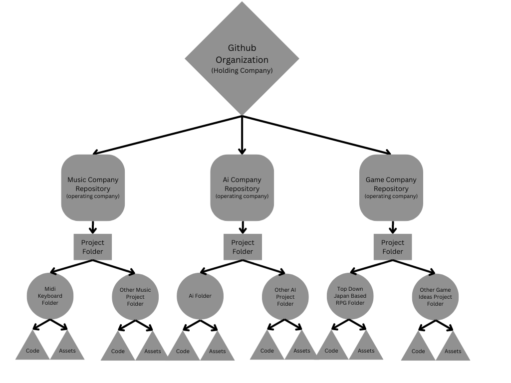

# Big Idea
Not sure where to put this idea down so Ill put it here and we can move it later. In this doc I will be talking more on the "business" side of things. 
We actually have some good ideas for projects that we have come up with over time and I think it might be a good time to think "seriously" about these.
Obviously this is just an idea and might sound cringe but I think we could actually start something here so I will detail a plan below. 

## Multiple Projects
Since we seem to create multiple project ideas we should have one spot to list them. Im thinking of one github org that hold the repos for all of the smaller projects.
These projects dont need to be actively worked on but we can store them there and then work on them whenever we want to. Some of the project ideas we have so far,
(keep in mind some of these are just ideas and may remain as just that), midi keyboard, our own ai, tabletop simulator kind of thing with ai elements, IDE with ai elements, video game ideas, 
etc.

## Main github org
What I propose is that we create a bigger github organization that represents our larger "holding company". A holding company is something you establish for the purpose of 
owning and organizing one or more other companies. We can think of a good name for this later but we should make a github organization to represent this. This github organization
will then hold repositories for the smaller "comapnies". We can have one for the midi keyboard, one for ai related things, and we can add soupbox games if we want to go into that as well.
These smaller repos can then posess a folder in them called "projects" which will hold a folder for each project idea. The project folders can then hold everything related for the project like the
github for the midi keyboard currently has. 

## Multiple "Companies"
The main part of this idea is to seperate all the projects into "holdings" or smaller "companies" (Im using quotes as I dont know if this is the correct way to describe what im talking about).
The companies will hold related projects, for example, the repository for our "music company" will hold the midi keyboard idea as well as any other music related ideas we may come up with, 
soupbox will hold all video game related projects, and we can make an ai company to hold the project that would contain the ai as well as any related projects. 

## Again just and idea
Again, this is just an idea so it doesnt need to be taken super seriously. Even if we dont really care about taking this far, I think it would just be a good idea to gather all of our
ideas in a single place. This will be good for organization being that all of the information for everything will be in one place in clearly labeled areas. We could jump on and work on any of the ideas
we have whenever we want but all of it will be put down somewhere and tracked by version control.

## If we want to take this seriously
If we do want to take this seriously, this would be a great start to laying out the foundation for a holding company or parent company, and smaller operating companies or subsidaries. We would need to come up 
with a name together for the parent company as well as names and ideas for the operating companies. We could potentially register this as an actual LLC and then use that to start declaring tax writeoffs. Ive been
pressured by my dad to create a personal LLC for this reason. Long term we could find other people who are interested in projects like the ones we have though of and bring them in to help create them if they want.
I dont know if Jack or anyone in that group would be interested or what value they might bring to this idea but if they want to help and could provide something useful I would love to have them.

## Standards
Now I propose that if we do want to go along this route, we develop standards for both the operating company repos and the project folders. Obviously each projects assets will differ but I think we should have
a standardized way of organizing everything. We can work together to create these standards but I just wanted to put the idea out there.

## Overall
Overall this is just an idea obviously but I think if we actually wanted this to happend and we just focus on making ideas that we think are cool, we might be able to turn this into a real thing. Who knows,
maybe it could lead to the start of something big and then we can play DND with the boys on a giga yacht, maybe this will just all fizzle out into nothing, and maybe this will just remain as it is, us working
on cool ideas with little to no gain or moderate gain. All in all we could try and make something here, Im genuinly interested in our ideas and from talking about them with parents and other people it seems like
some of our ideas could be something useful. We could definitly benefit from a super organized way of doing all of this and definitly benefit from more help. Anyway, that is all for now, I am definity rambling here but I just wanted to get this idea out there and on paper so I have just been typing everything that has come to my head. If we want to go this route we definitly should set up everything together so that we are both on the same page. Also feel free to move this file, I didnt know where to put it.

## Organization/Repo/Folder Structure

## Github Org/Holding company name ideas
#### Chayco LLC. - mix of Chandler and May with an added CO at the end to make it sound less gay
#### Manay LLC. - mix of Manning and May
#### Solitude LLC. - Came from Skyrim but I think their city names sound cool as company names or project place holder names. Most definitly a thing already
#### Talisman LLC. - Randomly Generated
#### Catalyst Group - Randomly Generated

## Music Repo/Company name ideas
#### Patched - Coming from the idea of "pathing in"
#### PATCH3D - Above but more edgy, maybe people will read it as PATCH 3D and give some explaination as to why we named it that which we will then go along with like it was our plan all along. 
#### ReWrk - Sounds like something that makes music equiptment
#### R3Wrk - Above but more edgy
#### SYNAP - Synth, synapse, snap, if the keyboard will make a snap sound when attaching modules this may be cool.

## Game Repo/Company name ideas
#### Soupbox Games - Im kind of married to this idea already but if there are other cool name ideas I would love to hear them

## AI Repo/Company name ideas
#### Something like JARVIS form iron man, an abreviation that sounds like a name. May be gay but might be cool.

